<div align="center">

<!-- ═══════════════════════════════════════════════════════════════ -->
<!-- HEADER                                                          -->
<!-- ═══════════════════════════════════════════════════════════════ -->



<br>


<br>
<br>

<!-- ═══════════════════════════════════════════════════════════════ -->
<!-- STATS DASHBOARD                                                 -->
<!-- ═══════════════════════════════════════════════════════════════ -->

<table align="center"><tr>
<td align="center" width="380">

<picture>
  <source media="(prefers-color-scheme: dark)" srcset="https://github-readme-stats.vercel.app/api?username=qosu&show_icons=true&theme=tokyonight&hide_border=true&bg_color=0d1117&title_color=c4b5fd&icon_color=a78bfa&text_color=8b9dc3&ring_color=a78bfa&hide=stars&rank_icon=percentile&custom_title=⟐  𝔤𝔦𝔱𝔥𝔲𝔟  𝔰𝔱𝔞𝔱𝔰">
  
</picture>

</td><td align="center" width="380">

<picture>
  <source media="(prefers-color-scheme: dark)" srcset="https://github-readme-stats.vercel.app/api/top-langs/?username=qosu&layout=compact&theme=tokyonight&hide_border=true&bg_color=0d1117&title_color=c4b5fd&text_color=8b9dc3&langs_count=8&exclude_repo=qosu&custom_title=⟐  𝔩𝔞𝔫𝔤𝔲𝔞𝔤𝔢𝔰">
  
</picture>

</td></tr>
</table>

<br>

<!-- ═══════════════════════════════════════════════════════════════ -->
<!-- TECH STACK                                                      -->
<!-- ═══════════════════════════════════════════════════════════════ -->

### ◈ 𝔱𝔢𝔠𝔥 𝔰𝔱𝔞𝔠𝔨

<p>
  <kbd> Python </kbd> 
  <kbd> Lean 4 </kbd> 
  <kbd> Linux </kbd> 
  <kbd> Docker </kbd> 
  <kbd> Nix </kbd> 
  <kbd> Rust </kbd> 
  <kbd> SAT / SMT </kbd> 
  <kbd> Z3 </kbd> 
  <kbd> GraphQL </kbd>
</p>

<br>

<!-- ═══════════════════════════════════════════════════════════════ -->
<!-- TROPHY                                                          -->
<!-- ═══════════════════════════════════════════════════════════════ -->

<picture>
  <source media="(prefers-color-scheme: dark)" srcset="https://github-profile-trophy.vercel.app/?username=qosu&theme=onedark&no-frame=true&column=7&margin-w=8&title=MultiLanguage,Commits,Repositories,Experience,Stars,Followers,PullRequest">
  
</picture>

<br>
<br>

<!-- ═══════════════════════════════════════════════════════════════ -->
<!-- CORE PROJECTS — CARD LAYOUT                                     -->
<!-- ═══════════════════════════════════════════════════════════════ -->

## ◈ 𝔠𝔬𝔯𝔢 𝔭𝔯𝔬𝔧𝔢𝔠𝔱𝔰

<table align="center">
<tr>
<td width="50%" valign="top">

<h3 align="center">
  <a href="https://github.com/qosu/rewrite-protocol">
    <samp>𝔯𝔢𝔴𝔯𝔦𝔱𝔢-𝔭𝔯𝔬𝔱𝔬𝔠𝔬𝔩</samp>
  </a>
</h3>

<p align="center"><i>Spacetime as a Self-Correcting Computational Medium</i></p>

<p align="center">
  <sub>Born rule emerges from Kolmogorov complexity minimization — not fundamental, not observer-dependent. The universe rewrites its past to maintain consistency.</sub>
</p>

<p align="center">
  <kbd>theoretical physics</kbd> <kbd>complexity theory</kbd>
</p>

</td>
<td width="50%" valign="top">

<h3 align="center">
  <a href="https://github.com/qosu/exocortex">
    <samp>𝔢𝔵𝔬𝔠𝔬𝔯𝔱𝔢𝔵</samp>
  </a>
</h3>

<p align="center"><i>Symbiotic AI Wearable — Real-time Cognitive Enhancement</i></p>

<p align="center">
  <sub>Socratic prompting that makes you smarter, not lazier. Anti-brainrot theorem, fading scaffold, blindspot detection.</sub>
</p>

<p align="center">
  <kbd>ai</kbd> <kbd>cognitive science</kbd> <kbd>wearable</kbd>
</p>

</td>
</tr>
<tr>
<td width="50%" valign="top">

<h3 align="center">
  <a href="https://github.com/qosu/longsystems-research">
    <samp>𝔩𝔬𝔫𝔤𝔰𝔶𝔰𝔱𝔢𝔪𝔰-𝔯𝔢𝔰𝔢𝔞𝔯𝔠𝔥</samp>
  </a>
</h3>

<p align="center"><i>Research Archive — Formal Claims & Knowledge Graph</i></p>

<p align="center">
  <sub>Verified claims, KG entries, SAT+Lean4 formal verification of combinatorial bounds: Schur numbers, Ramsey theory, Rado numbers.</sub>
</p>

<p align="center">
  <kbd>formal verification</kbd> <kbd>lean4</kbd> <kbd>combinatorics</kbd>
</p>

</td>
<td width="50%" valign="top">

<h3 align="center">
  <a href="https://github.com/qosu/timetravel">
    <samp>𝔱𝔦𝔪𝔢𝔱𝔯𝔞𝔳𝔢𝔩</samp>
  </a>
</h3>

<p align="center"><i>Causal Fracture Engine — 6-file Core Engine</i></p>

<p align="center">
  <sub>Novikov self-consistency in simulated universes. Paradox detection, classification, resolution.</sub>
</p>

<p align="center">
  <kbd>physics simulation</kbd> <kbd>ctc</kbd> <kbd>causality</kbd>
</p>

</td>
</tr>
</table>

<br>

<!-- ═══════════════════════════════════════════════════════════════ -->
<!-- RESEARCH DOMAINS — ASCII ART                                    -->
<!-- ═══════════════════════════════════════════════════════════════ -->

## ◈ 𝔯𝔢𝔰𝔢𝔞𝔯𝔠𝔥 𝔡𝔬𝔪𝔞𝔦𝔫𝔰

```
╔══════════════════════════════════════════════════════════════════╗
║  ┌─ FORMAL VERIFICATION ─────────────────────────────────┐     ║
║  │  SAT-certificate generation → Lean4 kernel audit      │     ║
║  │  Schur numbers S(3..8) formally verified              │     ║
║  │  Ramsey lower bounds · Rado numbers · Folkman numbers │     ║
║  │  Weak Schur W(3,k) · EGZ theorem · Markoff unicity    │     ║
║  └───────────────────────────────────────────────────────┘     ║
║                                                                ║
║  ┌─ THEORETICAL PHYSICS ───────────────────────────────┐     ║
║  │  Born rule as emergent phenomenon (complexity min.)  │     ║
║  │  Closed Timelike Curves & Novikov self-consistency   │     ║
║  │  Spacetime as self-correcting computational medium   │     ║
║  │  Quantum foundations · Causal fracture mechanics     │     ║
║  └──────────────────────────────────────────────────────┘     ║
║                                                                ║
║  ┌─ AI ARCHITECTURE ───────────────────────────────────┐     ║
║  │  Adversarial epistemic parliaments                   │     ║
║  │  Knowledge graph construction from deep research     │     ║
║  │  Falsification-first reasoning protocols             │     ║
║  │  Horizon projection engines · Synthetic KG futures   │     ║
║  └──────────────────────────────────────────────────────┘     ║
╚══════════════════════════════════════════════════════════════════╝
```

<br>

<!-- ═══════════════════════════════════════════════════════════════ -->
<!-- SNAKE                                                            -->
<!-- ═══════════════════════════════════════════════════════════════ -->

<picture>
  <source media="(prefers-color-scheme: dark)" srcset="https://raw.githubusercontent.com/qosu/qosu/output/github-contribution-grid-snake-dark.svg">
  <source media="(prefers-color-scheme: light)" srcset="https://raw.githubusercontent.com/qosu/qosu/output/github-contribution-grid-snake.svg">
  
</picture>

<br>

<!-- ═══════════════════════════════════════════════════════════════ -->
<!-- FOOTER                                                           -->
<!-- ═══════════════════════════════════════════════════════════════ -->

---

<br>

<p align="center">
  <samp>
    <a href="https://github.com/qosu">github</a>
    <span>·</span>
    <a href="https://github.com/qosu/longsystems-research">research</a>
    <span>·</span>
    <a href="https://arxiv.org">papers</a>
    <span>·</span>
    <a href="https://github.com/qosu/qosu">profile</a>
  </samp>
</p>

<p align="center">
  <sub>
    
    <span>&nbsp;·&nbsp;</span>
    
    <span>&nbsp;·&nbsp;</span>
    
  </sub>
</p>

<br>

<p align="center">
  <sub>
    <samp>𝔮𝔬𝔰𝔲</samp>
    <span>&nbsp;·&nbsp;</span>
    <samp>longsystems research entity</samp>
    <span>&nbsp;·&nbsp;</span>
    <samp>est. 2026</samp>
  </sub>
</p>

<br>

<!-- ═══════════════════════════════════════════════════════════════ -->
<!-- HIDDEN EASTER EGG                                               -->
<!-- ═══════════════════════════════════════════════════════════════ -->

<details>
<summary><sub>⚛</sub></summary>
<br>
<p align="center">
  <sub>“The universe does not speak in equations — it rewrites its own source code.</sub>
  <br>
  <sub>We are not observers of reality; we are participants in its compilation.”</sub>
</p>
</details>

</div>
